# 📰 EngNews

**EngNews** là ứng dụng **đọc báo tiếng Anh thông minh** được phát triển bằng **Flutter**, hướng đến việc giúp người dùng **nâng cao khả năng đọc hiểu tiếng Anh** thông qua các bài báo thực tế, ngắn gọn, dễ hiểu và được hỗ trợ bởi công nghệ **AI tóm tắt nội dung, dịch bài sang tiếng việt, bình luận trực tiếp, chia sẻ bài, và đề xuất bài liên quan**.  
Ứng dụng không chỉ là nơi để đọc tin tức — mà còn là một **người bạn đồng hành trong hành trình học tiếng Anh** của bạn.


# 🎬 Video Demo

- Xem demo ứng dụng tại: [Engnews_App](https://drive.google.com/drive/folders/1XegvjCYXDEgBsOOnvAMEoq4bZzYowxLA?hl=vi)


# 🌟 Giới thiệu chi tiết

Trong bối cảnh tiếng Anh ngày càng quan trọng, việc đọc báo nước ngoài là một trong những phương pháp hiệu quả để nâng cao vốn từ vựng, khả năng diễn đạt và phản xạ ngôn ngữ. Tuy nhiên, nhiều người gặp khó khăn vì bài báo dài, nhiều từ lạ và thiếu động lực học.  
**EngNews** ra đời để giải quyết những vấn đề đó: mang đến **một không gian đọc báo học tiếng Anh nhẹ nhàng, thú vị và hiệu quả**, với sự hỗ trợ mạnh mẽ từ **AI** và thiết kế hiện đại.

EngNews được thiết kế với phương châm:

> “Đọc báo để hiểu thế giới — và hiểu cả ngôn ngữ của thế giới.” 🌍

Ứng dụng phù hợp với:
- Học sinh, sinh viên muốn rèn luyện kỹ năng đọc hiểu tiếng Anh.  
- Nhân viên văn phòng muốn cập nhật tin tức quốc tế và luyện ngoại ngữ song song.  
- Người học tự do muốn mở rộng vốn từ, học cách viết tự nhiên qua báo chí.


# 🚀 Các tính năng chính  

## 👤 Các chức năng dành cho User  

### 📰 1. Trải nghiệm đọc báo hiện đại  
- Hiển thị **danh sách bài báo nổi bật** ngay trên trang chủ.  
- Cập nhật tin tức tiếng Anh mới mỗi ngày từ nhiều chủ đề: **Công nghệ, Giáo dục, Môi trường, Kinh tế, Văn hóa, Giải trí...**  
- Giao diện thân thiện, thiết kế tối giản, dễ tập trung vào nội dung.  
- Hỗ trợ **Dark Mode** để đọc buổi tối thoải mái hơn.  

### 📖 2. Xem chi tiết bài báo  
- Đọc từng bài báo với bố cục đẹp, font chữ dễ nhìn, khoảng cách dòng hợp lý.  
- Cho phép bình luận và tương tác với các người dùng khác

### 🔊 3. Đọc bài báo bằng giọng nói (Text To Speech – TTS)  
- Hỗ trợ **đọc bài báo bằng giọng nói tiếng Anh**.  
- Phù hợp cho người luyện **nghe – phát âm** hoặc nghe khi không tiện đọc.  

### 🤖 4. Tóm tắt nội dung bằng AI  
- AI tự động **tóm tắt nội dung bài báo** trong vài dòng súc tích.  
- Giúp người dùng **nắm bắt ý chính nhanh chóng** trước khi đọc chi tiết.  

### 🌐 5. Dịch bài báo sang tiếng Việt  
- Hỗ trợ **dịch toàn bộ bài báo từ tiếng Anh sang tiếng Việt**.  
- Giúp người học dễ dàng **đối chiếu nội dung song ngữ**.  

### ❤️ 6. Lưu và quản lý bài viết yêu thích  
- Lưu lại các bài báo bạn yêu thích hoặc muốn đọc lại.  
- Quản lý dễ dàng trong mục **“Yêu thích”**.  
- Có thể sắp xếp hoặc phân loại theo **chủ đề**.  

### 🔍 7. Tìm kiếm & lọc bài báo thông minh  
- Tìm kiếm bài báo theo **từ khóa, chủ đề hoặc tag**.  
- Hỗ trợ **gợi ý từ khóa tự động** giúp tìm kiếm nhanh hơn.  

### 💡 8. Gợi ý bài báo liên quan  
- Sau khi đọc xong, hệ thống AI sẽ **gợi ý các bài viết tương tự**.  
- Gợi ý dựa trên:
  - Thói quen đọc  
  - Chủ đề và từ vựng người dùng thường quan tâm.  

### 🔔 9. Thông báo bài báo mới  
- Gửi **thông báo khi có bài báo mới** được đăng.  
- Giúp người dùng không bỏ lỡ các nội dung quan trọng.  

### 🔐 10. Tài khoản & quản lý người dùng  
- **Đăng ký / đăng nhập bằng Google**.  
- Hỗ trợ **quên mật khẩu** và **đổi mật khẩu thông qua email**.  
- Chỉnh sửa **hồ sơ cá nhân**:
- **Chia sẻ bài viết** qua các nền tảng khác.  
  
## 🛠️ Các chức năng dành cho Admin:
### 📊 1. Thống kê tổng quan
- Thống kê:
  - Tổng số người dùng
  - Tổng số bài viết
  - Lượt xem bài báo
  - Hoạt động người dùng

### 🗂️ 2. Quản lý danh mục
- Thêm / sửa / xóa danh mục.
- Hiển thị danh sách danh mục bài viết.
- Bật / tắt hiển thị danh mục trên ứng dụng.

### 📝 3. Quản lý bài viết
- Thêm mới bài viết.
- Chỉnh sửa nội dung bài viết.
- Xóa bài viết.
- Quản lý trạng thái hiển thị bài viết.

### 👥 4. Quản lý người dùng
- Xem danh sách người dùng.
- **Block / Unblock user**.
- Chỉnh sửa thông tin người dùng.
- Phân quyền (**User / Admin**).

### 🧑‍💼 5. Quản lý hồ sơ Admin
- Chỉnh sửa thông tin cá nhân Admin.
- Thay đổi mật khẩu và thông tin đăng nhập.

# 📸 Giao diện các màn hình ứng dụng

## 1. Authentication & Onboarding
*Welcome screen and user authentication: Welcome, Login, Register, Forgot Password*
<table>
<tr>
  <td>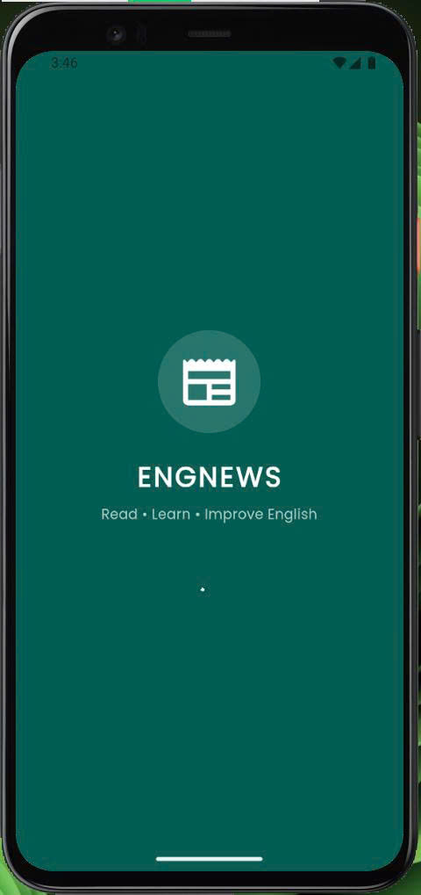</td>
  <td></td>
  <td>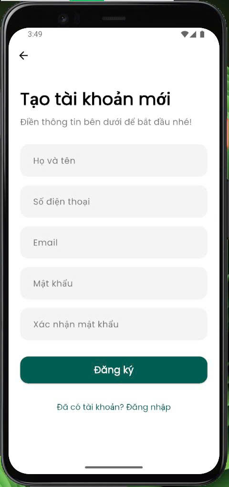</td>
  <td>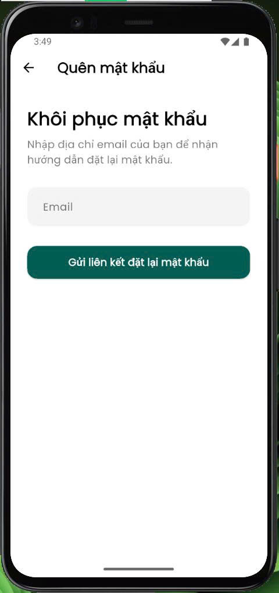</td>
</tr>
</table>

## 2. Main Features – User Screens
*Main function screens for users: Home, News, Categories, Saved Articles, User Profile*
<table>
<tr>
  <td></td>
  <td>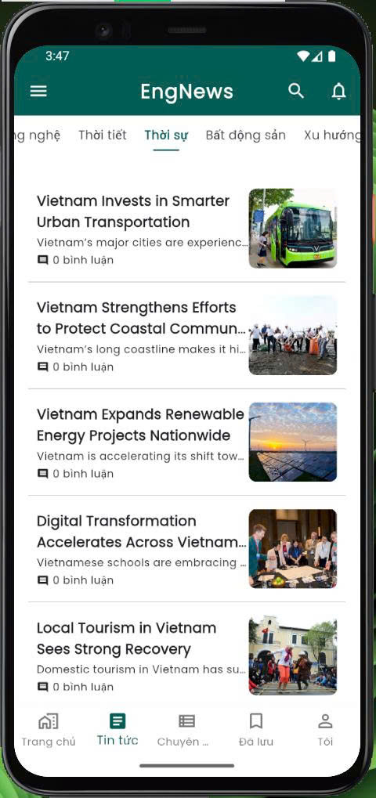</td>
  <td>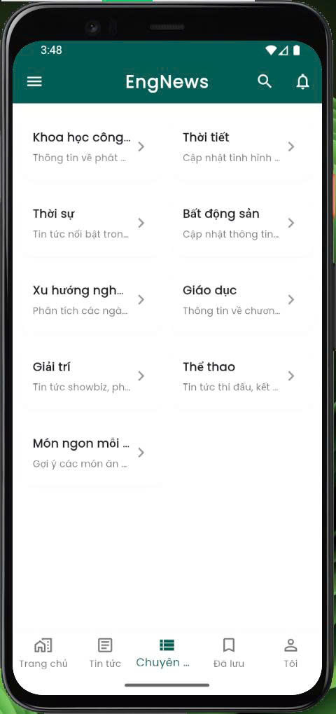</td>
  <td>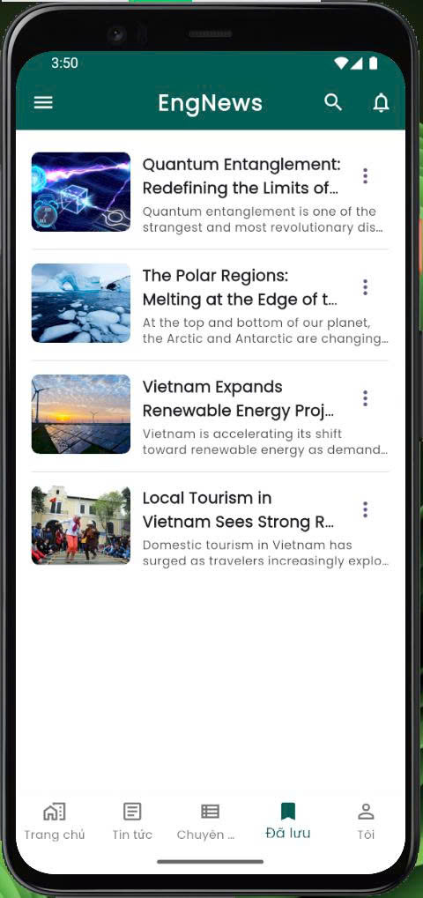</td>
</tr>
<tr>
  <td>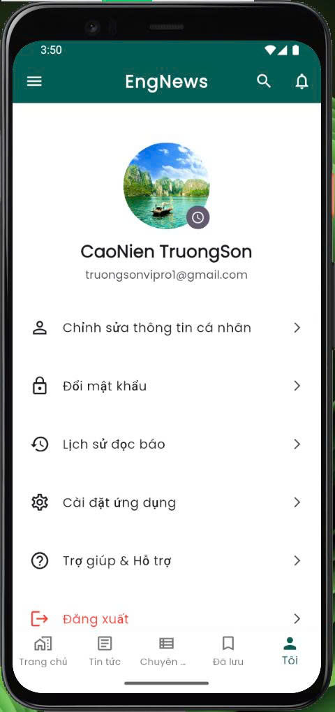</td>
</tr>
</table>

## 3. Utilities & Settings
*Search, notifications and system settings: Search, Notifications, Settings & Dark Mode*
<table>
<tr>
  <td>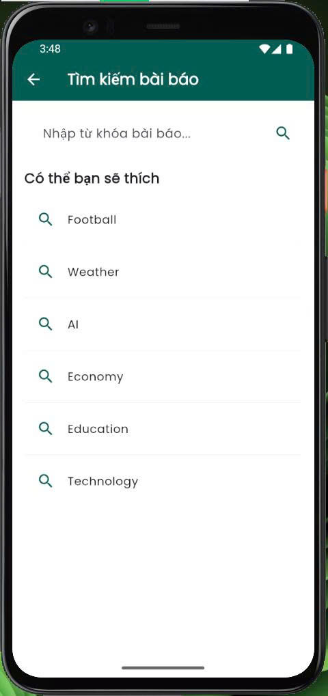</td>
  <td>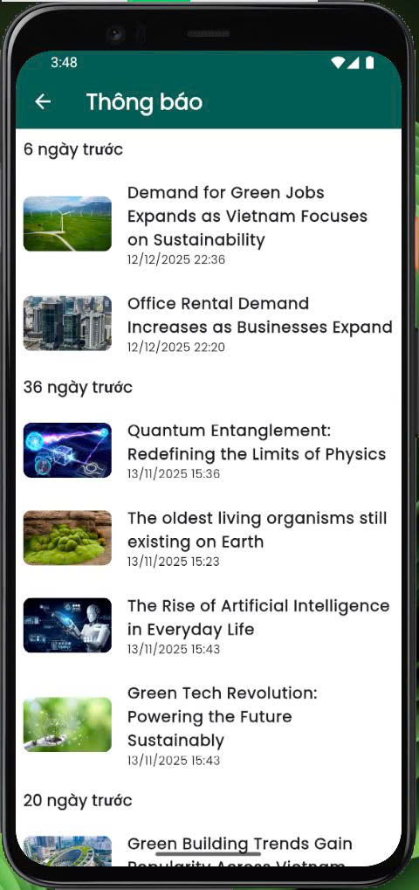</td>
  <td>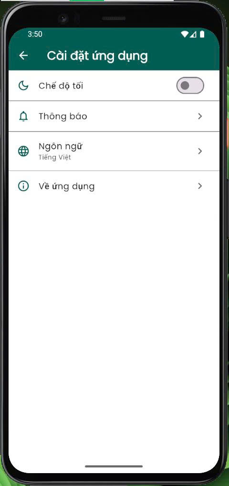</td>
  <td>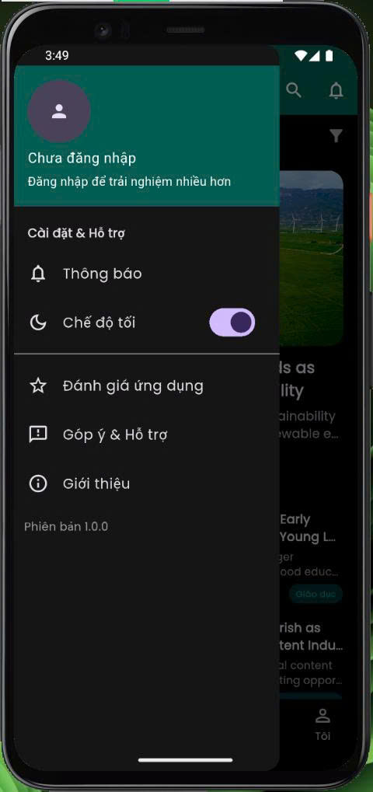</td>
</tr>
</table>

## 4. Article Details & Interaction
*Article details and user interaction: Article Detail, Comments, Reading History*
<table>
<tr>
  <td></td>
  <td>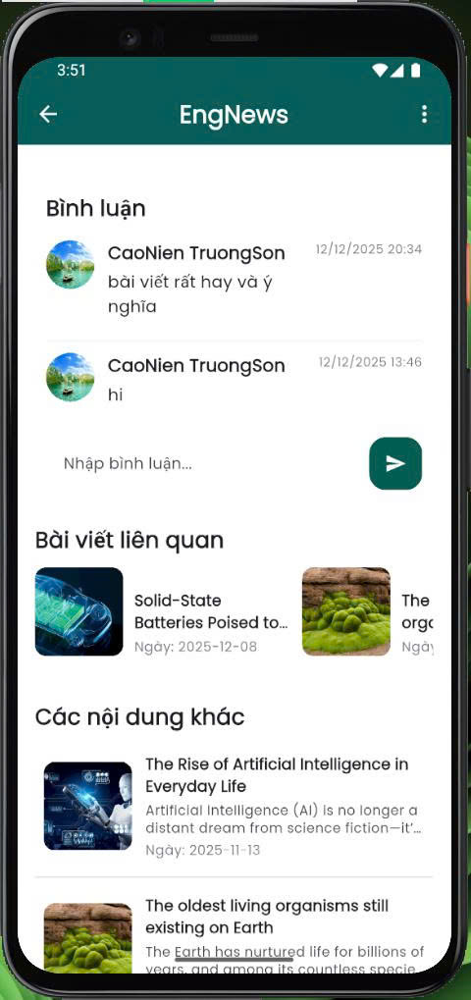</td>
  <td>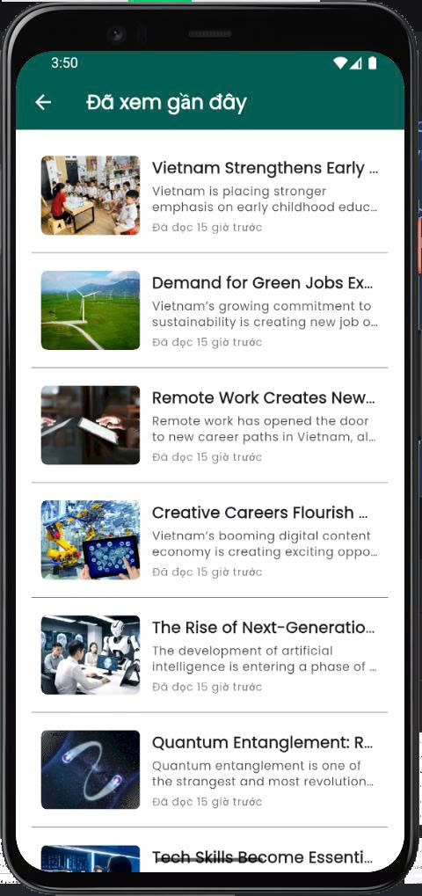</td>
</tr>
</table>

## 5. Admin Panel – Content Management
*Content management screen: Dashboard · Menu · Categories · Posts · Users · Admin Profile*
<table>
<tr>
  <td>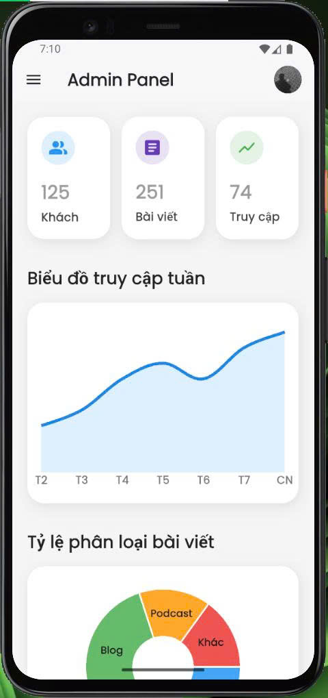</td>
  <td>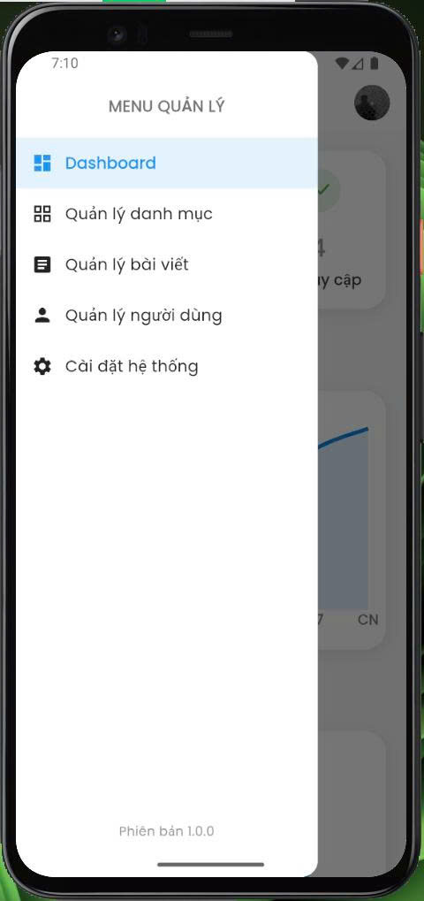</td>
  <td>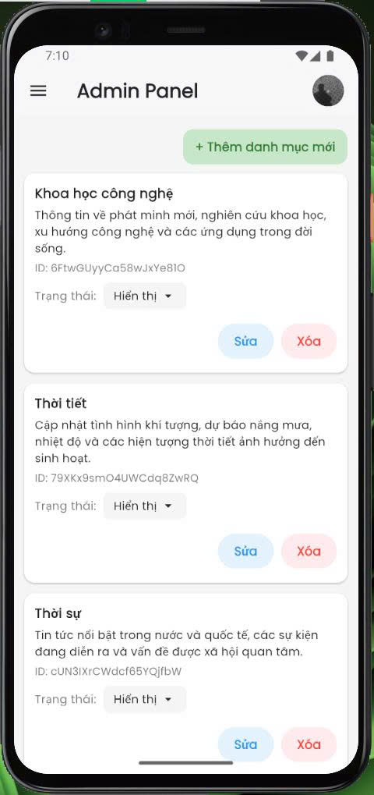</td>
  <td>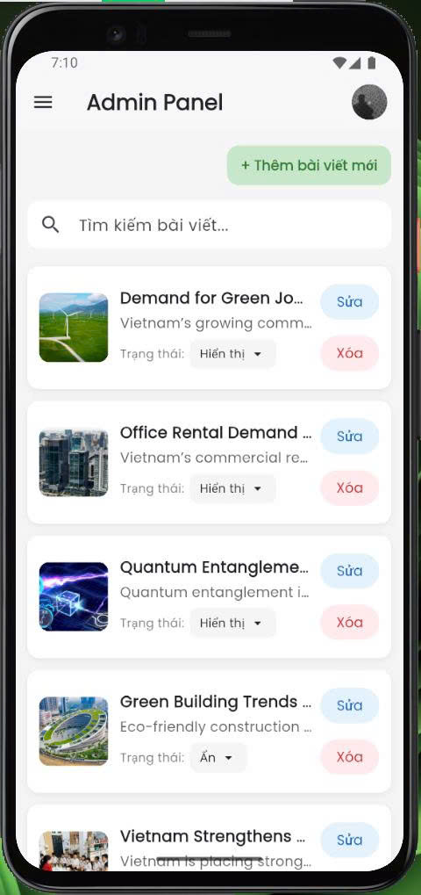</td>
  <td>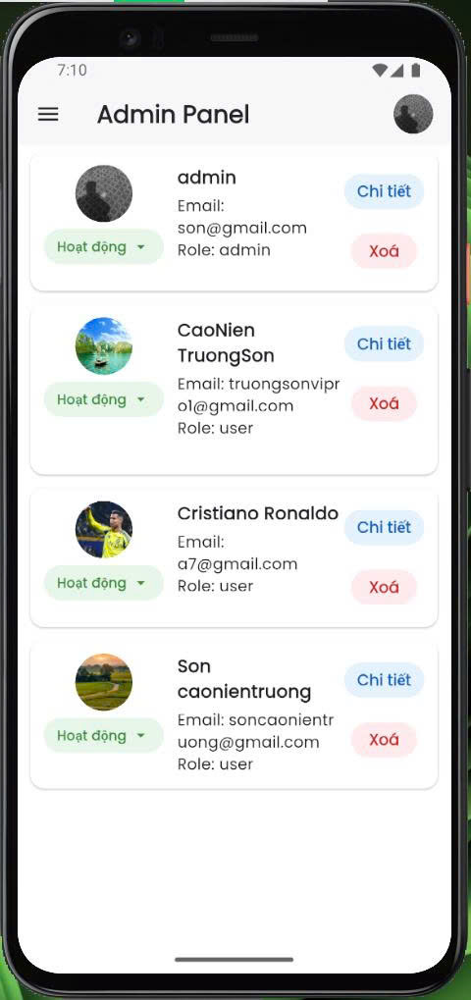</td>
  <td>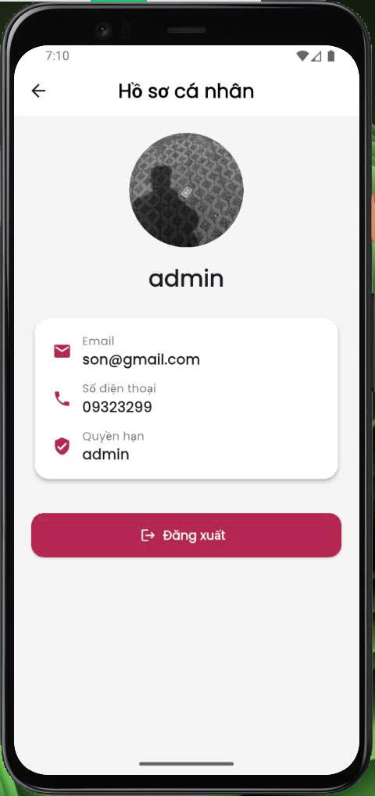</td>
</tr>
</table>


# 📁 Cấu trúc thư mục chính:
```
lib/
├── core/
│   ├── theme/
│   ├── Architecture/
│   ├── color.dart
│   └── List_usecase
├── features/
│   ├── admin/
│   │   └── screens/
│   │       ├── add_article_page.dart
│   │       ├── add_category_page.dart
│   │       ├── admin_dashboard_screen.dart
│   │       ├── article_manager_page.dart
│   │       ├── category_manager_page.dart
│   │       ├── dashboard_page.dart
│   │       ├── edit_article_page.dart
│   │       ├── edit_categorypage.dart
│   │       ├── edit_user_screen.dart
│   │       ├── profile_screen.dart
│   │       ├── statistics_page.dart
│   │       ├── system_settings_page.dart
│   │       └── user_manager_page.dart
│   ├── models/
│   │   ├── article_model.dart
│   │   ├── category_model.dart
│   │   ├── comment_model.dart
│   │   ├── podcast_model.dart
│   │   ├── reading_history_model.dart
│   │   └── user_model.dart
│   ├── users/
│   │   └── screens/
│   │       ├── article_comments_widget.dart
│   │       ├── article_detail_bottom_menu.dart
│   │       ├── article_detail.dart
│   │       ├── article_speech_widget.dart
│   │       ├── articles_by_category_screen.dart
│   │       ├── banner_article_.dart
│   │       ├── category_tab.dart
│   │       ├── change_password_screen.dart
│   │       ├── edit_profile_screen.dart
│   │       ├── forgot_password_screen.dart
│   │       ├── highlightBanner.dart
│   │       ├── home_screen.dart
│   │       ├── home_tab.dart
│   │       ├── latest_articles_screen.dart
│   │       ├── login_screen.dart
│   │       ├── notification_screen.dart
│   │       ├── notification_settings_screen.dart
│   │       ├── podcast_tab.dart
│   │       ├── profile_tab.dart
│   │       ├── ramdom_article.dart
│   │       ├── reading_history_screen.dart
│   │       ├── register_screen.dart
│   │       ├── related_articles_widget.dart
│   │       ├── saved_articles_screen.dart
│   │       ├── search_tab.dart
│   │       ├── setting_screen.dart
│   │       └── splash_screen.dart
│   ├── service/
│   ├── authentication/
│   └── viewmodel/
│       ├── ai_viewmodel.dart
│       ├── article_viewmodel.dart
│       ├── authen_viewmodel.dart
│       ├── category_viewmodel.dart
│       ├── comment_viewmodel.dart
│       ├── favorite_viewmodel.dart
│       ├── notification_viewmodel.dart
│       ├── podcastViewModel.dart
│       ├── reading_history_viewmodel.dart
│       ├── speech_viewmodel.dart
│       ├── translateViewModel.dart
│       └── user_manager_viewmodel.dart
├── firebase_options.dart
└── main.dart
screenshots/
test/
```

# 🛠️ Công nghệ sử dụng

- 🐦 **Flutter** – Framework phát triển ứng dụng đa nền tảng (Android, iOS).  
- 🎯 **Dart** – Ngôn ngữ lập trình chính của dự án.  
- 🧱 **MVVM + Provider** – Kiến trúc và quản lý trạng thái, dễ mở rộng và bảo trì.  
- 🔥 **Firebase Core** – Kết nối và cấu hình các dịch vụ Firebase.  
- 🔐 **Firebase Authentication** – Xác thực người dùng (Email, Google, quên mật khẩu).  
- ☁️ **Cloud Firestore** – Cơ sở dữ liệu lưu trữ bài báo và thông tin người dùng.  
- 🟢 **Google Sign-In** – Đăng nhập nhanh bằng tài khoản Google.  
- 🤖 **Gemini / ChatGPT API** – Tóm tắt nội dung và gợi ý bài báo bằng AI.  
- 🌐 **Translator API** – Dịch bài báo từ tiếng Anh sang tiếng Việt.  
- 🔊 **Flutter TTS** – Đọc bài báo bằng giọng nói (Text To Speech).  
- 📤 **Share Plus** – Chia sẻ bài viết qua các nền tảng khác.  
- ✒️ **Google Fonts** – Tùy chỉnh font chữ hiện đại, dễ đọc.  
- 🌍 **Intl** – Định dạng ngày giờ và ngôn ngữ.  
- 📊 **FL Chart** – Hiển thị biểu đồ thống kê cho Admin.  
- 🔐 **Flutter Dotenv** – Quản lý biến môi trường và API Key.

# 🧠 Mục tiêu & định hướng của EngNews

- 🌟 Học tiếng Anh qua ngữ cảnh thực tế  
  - Nắm bắt từ vựng và cấu trúc câu thực tế  
  - Hiểu tiếng Anh trong bối cảnh tự nhiên  

- 📖 Nâng cao kỹ năng đọc hiểu và phản xạ ngôn ngữ  
  - Ghi nhớ từ vựng hiệu quả  
  - Phản xạ với câu, đoạn văn nhanh hơn  
  - Phát triển kỹ năng đọc lướt và đọc chi tiết  

- 🌐 Môi trường học tập toàn diện  
  - Theo dõi tiến độ học tập  
  - Học kết hợp nhiều kỹ năng: đọc, nghe, phản xạ  

- 🚀 Định hướng phát triển dài hạn  
  - Thêm bài tập, quiz và trò chơi học từ vựng  
  - Cá nhân hóa lộ trình học theo người dùng  
  - Hệ thống đánh giá và theo dõi tiến độ  
  - Tạo mạng xã hội học tập cho cộng đồng EngNews  


